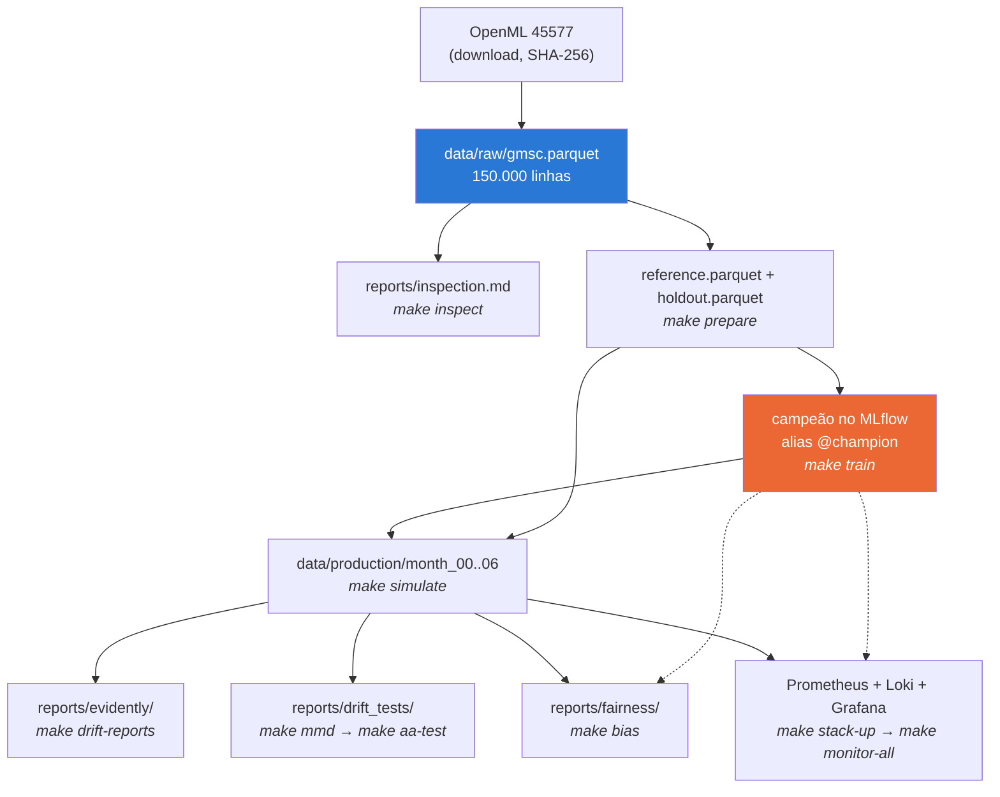

# Tech Challenge — Fase 4: Monitoramento de Modelo de Credit Scoring

[](https://github.com/rafaneder-maiorino/tech-challenge-fase4/actions/workflows/ci.yml)

Camada de sustentação e confiabilidade para um modelo de *credit scoring* em
produção. O projeto usa o dataset público **Give-Me-Some-Credit** (OpenML id
45577) e cobre contratos de qualidade de dados, simulação e detecção estatística
de *data drift* e *concept drift*, observabilidade de pipeline e modelo, análise
causal por intervenção, viés por grupo e a documentação de governança e
privacidade (LGPD).

**As quatro etapas estão entregues.** Contratos de dados e modelo baseline
(etapa 1), simulação e detecção estatística de drift (etapa 2), stack de
observabilidade com alertas testados e runbooks (etapa 3), governança, LGPD,
viés, causalidade e Model Card (etapa 4). Quinze achados registrados em
[`docs/findings.md`](docs/findings.md), vários deles refutando decisões
anteriores do próprio projeto.

## Caminho do avaliador

**Comece aqui.** `mlruns/` e `data/` são *gitignored*, então **o clone não traz
o modelo nem os dados** — ele traz o código que os produz. A ordem importa: um
comando fora de ordem falha, e a falha não é o projeto estar quebrado.

```bash
make install    # 1. ambiente (uv sync)
make all        # 2. a cadeia inteira, na ordem certa — ~4,5 min, ~1 GB
```

É isso. `make all` encadeia tudo abaixo e é o único comando necessário para
reproduzir cada número citado na documentação.

### A cadeia de artefatos



O nó laranja é o gargalo: **tudo depois dele precisa do campeão**, e o campeão
não vem no repositório.

### Os passos, o que cada um produz e do que depende

| # | comando | produz | depende de | tempo |
|---|---|---|---|---|
| 1 | `make install` | `.venv/` (852 MB) | uv | 3 s (cache quente) |
| 2 | `make download` | `data/raw/gmsc.parquet`, SHA-256 conferido | rede | 40 s |
| 3 | `make inspect` | `reports/inspection.md` | 2 | 1 s |
| 4 | `make prepare` | `reference.parquet` + `holdout.parquet` | 2 | 2 s |
| 5 | `make train` | **campeão** no MLflow, alias `@champion` | 4 | 18 s |
| 6 | `make simulate` | `data/production/month_00..06` + `reports/simulation/` | **5** | 6 s |
| 7 | `make drift-reports` | `reports/evidently/_build/` | 6 | 23 s |
| 8 | `make aa-test` | `reports/drift_tests/` (puxa `mmd` antes) | 6 | 155 s |
| 9 | `make bias` | `reports/fairness/` + 3 PNG | 6 | 7 s |
| 10 | `make seed-noise` | `reports/seed_noise.json` | 4 | 5 s |
| 11 | `make dashboards` | `monitoring/grafana/dashboards/*.json` | — | < 1 s |
| 12 | `make lint` · `make test` | 248 testes | 1 | 12 s |

**Observabilidade, à parte** porque precisa de Docker:

```bash
make stack-up      # Prometheus, Pushgateway, Loki, Alloy, Grafana  (~1 s)
make monitor-all   # empurra as métricas dos 3 cenários             (~11 s)
```

`make monitor-all` depende do passo 6 **e** do 5. Se o Grafana subir vazio,
falta este comando — as dashboards são provisionadas por arquivo, mas os dados
chegam por *push*.

### Orçamento de execução, medido

Num MacBook (Apple Silicon), clone limpo, do zero:

| | |
|---|---|
| **`git clone` + `make install` + `make all`** | **271 s (~4,5 min)**, medidos ponta a ponta |
| **passo mais lento** | `make aa-test` — 155 s, dominado por 1.000 permutações |
| **disco, repositório** | **967 MB**, dos quais **852 MB são o `.venv`** |
| disco, dados e relatórios | 23 MB (`data/`) + 84 MB (`reports/`) + 2,4 MB (MLflow) |
| **disco, imagens Docker** | **~2,9 GB** (Grafana 1,49 GB · Alloy 877 MB · Prometheus 339 MB · Loki 191 MB · Pushgateway 36 MB) |
| disco, volumes Docker | ~115 MB depois de um `make monitor-all` |

Com o cache do `uv` frio, o passo 1 leva ~2 min a mais. O download são 3,3 MB
da rede; o resto é local.

> **`make all` termina com `git status` limpo.** Todo relatório versionado é
> reproduzido byte a byte a partir do zero — `reports/simulation/`,
> `reports/drift_tests/`, `reports/fairness/`, `reports/seed_noise.json` e os
> três JSON das dashboards. Se algo aparecer como modificado depois de um
> `make all`, é um resultado que mudou, não ruído de execução.

### Se um comando falhar

Os pontos de entrada nomeiam o pré-requisito em vez de vazar um *stack trace*:

```
$ make simulate          # sem ter rodado make train
campeão não encontrado em models:/credit-default-baseline@champion — rode `make train` antes.
O registry do MLflow (mlruns/ e mlflow.db) é gitignored, então um clone novo não traz modelo nenhum.
A ordem é: make prepare -> make train.
Ou rode `make all`, que faz a cadeia inteira na ordem certa.
```

> **macOS, dois detalhes que custam tempo se pegarem de surpresa:**
>
> 1. **`brew install libomp` antes do `make train`.** O XGBoost precisa do
>    OpenMP em tempo de execução e ele não vem no *wheel*.
> 2. **A UI do MLflow usa a porta 5001, não a 5000.** No macOS a 5000 é do
>    AirPlay Receiver, que **responde** à requisição em vez de recusá-la — o
>    MLflow parece subir e serve um 403 alheio. Nenhuma porta deste projeto
>    usa a 5000.

## Comandos, um a um

```bash
make all        # a cadeia inteira na ordem certa — o atalho
make install    # cria o ambiente e instala as dependências (uv sync)
make download   # baixa o dataset bruto do OpenML e verifica o checksum
make inspect    # gera reports/inspection.md a partir do dado bruto
make prepare    # limpa o dado bruto e grava reference + holdout
make train      # treina os baselines e registra o campeão no MLflow
make simulate   # gera seis meses de drift, pontua e escreve o resumo
make lint       # roda o ruff (lint + verificação de formatação)
make test       # roda a suíte de testes (pytest)
```

Análises (todas dependem de `make simulate`):

```bash
make drift-reports  # relatórios do Evidently (em _build/, ignorado)
make mmd            # MMD nos lotes e localização por par — escreve só o cache
make aa-test        # teste A/A e o resumo estatístico (puxa `mmd` antes)
make bias           # justiça por faixa etária + os três PNG
make seed-noise     # piso de ruído de AUC e KS em cinco sementes
```

> **`make aa-test` depende de `make mmd`, e o Makefile força a ordem.** Quem
> escreve `reports/drift_tests/summary.md` é o `aa-test`, e ele só preenche a
> seção de MMD se o cache já existir. Na ordem inversa o resumo sai com um
> texto de espera no lugar da tabela.

Demonstração do portão de qualidade e achados:

```bash
make validate-bad-batch     # lote com defeitos: verdicto BLOCKED, sai != 0
make validate-clean-batch   # lote só com alertas: ACCEPTED_WITH_WARNINGS, sai 0
make recheck-correlation    # recalcula a correlação — REESCREVE docs/findings.md §4
make mlflow-ui              # UI do MLflow na porta 5001
```

> `make validate-bad-batch` sai com código **diferente de zero por desenho** —
> o portão bloqueou o lote, que é o comportamento correto. Por isso ele não
> entra no `make all`. E `make recheck-correlation` **reescreve um arquivo
> versionado** (a data do achado §4): esperar `git status` sujo depois dele é o
> normal.

## Relatórios versionados: gerar não é publicar

`make drift-reports` escreve em `reports/evidently/_build/`, que é **ignorado**.
`make publish-reports` é o **único** comando que toca nos HTML versionados.

A separação não é preciosismo. O HTML do Evidently não é determinístico byte a
byte: a variável JavaScript do relatório recebe um UUID aleatório a cada
execução, e duas gerações do **mesmo** dado diferem em ~2.300 posições num
arquivo de 4 MB. Gerar direto no caminho versionado faria de toda regeneração de
rotina um diff de seis arquivos de 4 MB com os mesmos números dentro — e um
`git commit -a` distraído põe isso no histórico para sempre.

**Publique em pontos deliberados** — fim de etapa, entrega final. Nunca como
efeito colateral de olhar um relatório. Depois de publicar, confira o diff antes
de commitar.

## Stack de observabilidade (etapa 3)

```bash
make stack-up        # Prometheus, Pushgateway, Loki, Alloy e Grafana
make monitor-all     # empurra as métricas de todos os lotes de uma vez
make monitor-replay  # mês a mês, com pausa (PAUSE=20 por padrão)
make stack-down      # derruba, mantendo os volumes
```

| serviço | porta | papel |
|---|---|---|
| Grafana | 3000 | lê Prometheus e Loki |
| Prometheus | 9090 | armazena as métricas |
| Pushgateway | 9091 | recebe de job em lote |
| Loki | 3100 | armazena os logs |
| Alloy | 12345 | recolhe `logs/*.jsonl` |
| MLflow UI | 5001 | trilha de auditoria (`make mlflow-ui`) |

Nenhuma porta 5000: no macOS é do AirPlay Receiver, que **responde** à
requisição em vez de recusá-la. Toda imagem fixada em versão exata.

### Push, não scrape

O trabalho de drift é um lote: roda, reporta, termina. Não há processo de pé
para o Prometheus raspar. O Pushgateway é a ponte — e ele **recusa timestamp do
cliente**, marcando tudo com o instante do scrape. Empurrar sete meses em
sequência colapsaria a rampa num único instante.

A saída não é um timestamp, é um rótulo: a chave de agrupamento é
`{job, scenario, batch_id}`, então cada mês persiste como série própria e o
Grafana plota a rampa por rótulo. `scenario` carrega os braços da ablação da
etapa 2, para o 2x2 caber numa tela.

### `drift_verdict`: os códigos

O Prometheus guarda float64, então o veredito é um número:

| código | significado |
|---|---|
| `0` | ok — nenhuma feature cruzou 0,10 |
| `1` | alerta — alguma feature em [0,10; 0,25) |
| `2` | crítico — alguma feature em 0,25 ou acima |
| `-1` | **amostra insuficiente** — lote abaixo de `min_batch_size` |
| `-2` | **bloqueado** — o contrato recusou o lote; nenhum drift foi calculado |

Os dois sentinelas são negativos de propósito: ficam fora da ordenação 0..2,
para que um painel ordenando pelo código não leia "amostra insuficiente" ou
"bloqueado" como "menos drift que ok".

`stage_status` segue a mesma lógica: `1` ok, `0` falhou, **`-1` não executou**
porque um estágio anterior bloqueou. Zero seria mentira (o estágio não falhou,
nunca foi tentado) e `1` seria pior.

**Lote bloqueado curto-circuita o pipeline.** Depois de um bloqueio de contrato
nenhum estágio seguinte roda, e nenhuma métrica de drift, de predição ou de
rótulo é publicada — as linhas foram recusadas, e calcular um PSI sobre elas
produziria um número que parece medir a população e mede dado corrompido. O
`verdict` no MLflow é `blocked`.

**Abaixo de `min_batch_size`** (1.000, medido no teste A/A da etapa 2) o
veredito **nunca** é verde nem vermelho — a medição não consegue separar drift
do próprio viés, e pintar qualquer cor apresentaria isso como conhecimento.
`sample_sufficient` vai a 0 no mesmo lote. As duas condições são independentes:
um lote pode ser grande e bloqueado.

### Rótulos chegam atrasados, como na realidade

`label_lag_months` (2, em `configs/monitoring.yaml`) não é conveniência: é a
restrição que define o que o monitor pode saber e quando. No passo 6 do replay
existe desempenho medido para os meses 0 a 4 e **nenhum** para os meses 5 e 6 —
que já têm sinal de drift.

É também o que torna o **lead time** mensurável: a distância, em meses, entre o
primeiro lote degradado e o primeiro sinal de qualquer tipo. A métrica é
**assinada** — positivo é aviso antecipado, negativo é cegueira — e medida com
atraso 2 ela dá `full` **-1**, `composition_only` n/a, `stress_only` **-2**.

**Não há cenário positivo:** no melhor caso o alarme chega um mês depois do
dano, no pior não chega nunca. Ver [`docs/findings.md`](docs/findings.md) §13.

### Logs: sem dado pessoal, nunca

Cada estágio escreve uma linha JSON em `logs/`, com `batch_id`, `scenario` e
`stage` promovidos a rótulo do Loki. **Valor de feature nunca entra num log** —
um log é o artefato menos controlado que um pipeline produz, e as features aqui
são renda, idade e dívida de uma pessoa. A identidade da linha viaja como
**hash salgado do row_id**: o suficiente para correlacionar duas linhas sobre a
mesma linha de dado, insuficiente para reconstruir qualquer coisa sobre a
pessoa. Tentar registrar um campo de feature levanta exceção.

### Prometheus é operação, MLflow é auditoria

A mesma execução escreve nos dois, de propósito. O Prometheus responde "o que
está acontecendo agora e o que deveria acordar alguém"; o MLflow responde "o
que foi decidido, sobre qual dado, por qual versão do modelo". Reconstruir
qualquer um dos dois a partir do outro é chute.

## Causalidade: intervenção, refutação e diagnóstico (etapa 4)

**Documento completo: [`docs/causalidade.md`](docs/causalidade.md).**

**Por que isto é uma intervenção e não uma correlação:** nós controlamos o
processo gerador dos dados, então ligar e desligar um mecanismo é `do(M)` no
sentido de Pearl — os meses 0 a 6 são gerados quatro vezes com a **mesma
semente**, e qualquer diferença entre dois braços é o mecanismo, porque não
sobrou mais nada que pudesse tê-la causado.

Em produção essa tabela não existe: observa-se o total e discute-se de onde ele
veio. Construí-la agora é o que permite dizer "a degradação é **atribuível** a
X" em vez de "a degradação **coincide** com X".

### O DAG

```
Inflação ──┬─► renda nominal ↑ ──────────────┐
           │                                 ├─► modelo lê risco MENOR
           ├─► DebtRatio ↓ ──────────────────┘   do(inflação): QUASE INERTE
           │   (mesma dívida / renda maior)
           │
           └─► poder de compra real ↓
                    └─► utilização do rotativo ↑
                             └─► atraso 30-59d ↑
                                      └─► 60-89d ↑   (defasagem)
                                               └─► 90d+ ↑ ──► inadimplência ↑
                                                   do(estresse): DOMINA o dano

Aperto de crédito ──► novos perfis (mais jovens, mais alavancados)
                      do(composição): DOMINA a ordenação, não toca a calibração
```

### O que a intervenção mediu

| mecanismo | AUC m3 | AUC m6 | gap m3 | gap m6 | inadimpl. m6 |
|---|---|---|---|---|---|
| nenhum (mês 0) | 0,8601 | 0,8601 | -0,0027 | -0,0027 | 7,08% |
| `do(composição)` | 0,8455 | **0,8130** | -0,0001 | **-0,0028** | 21,00% |
| `do(inflação)` | 0,8563 | **0,8658** | +0,0014 | **-0,0049** | 7,00% |
| `do(estresse)` | 0,8157 | **0,7917** | -0,0171 | **-0,0337** | 10,04% |
| os três juntos | 0,8204 | **0,7779** | -0,0173 | **-0,0396** | 24,46% |

- **Composição** degrada a **ordenação** e não toca a calibração (gap -0,0028):
  os rótulos são reais, clientes mais arriscados de fato inadimplem mais, e as
  probabilidades continuam certas **para eles**.
- **Estresse** quebra as duas. É a assinatura do drift de conceito.
- **Inflação** é quase inerte, e o AUC até sobe.

### A refutação: o DAG acertou a direção e errou a magnitude

**A história desenhada atribuía a degradação silenciosa à inflação nominal** —
renda sobe, `DebtRatio` cai, o modelo lê risco menor, ninguém percebe. A
intervenção refutou a segunda metade:

| o DAG previu | `do(inflação)` produziu |
|---|---|
| o modelo lê risco **menor** | ✅ **confirmado** — previsto médio 0,0681 → 0,0652 |
| e isso causa a degradação silenciosa | ❌ **refutado** — são 29 pontos-base, e o AUC não cai |
| a degradação vem da medição | ❌ vem do **estresse**: **-0,0337 contra -0,0049** |

**O estresse causa quase sete vezes mais dano de calibração que a inflação.** A
razão é que **o campeão tira apenas 2,15% do seu ganho da renda** (nona de onze
features; as quatro primeiras concentram 82,07%). Mover 10% uma coluna que
responde por 2% do modelo desloca a previsão média em 29 pontos-base — que é
exatamente o que a intervenção mediu.

O DAG está **mantido como foi escrito**, com a refutação ao lado. Reescrevê-lo
para concordar com a medição transformaria uma previsão falsificada em sabedoria
retrospectiva.

### A tabela de decisão: assinatura → mecanismo

O pagamento prático. Dada uma degradação observada, o padrão de sinais
identifica a causa. Lê-se de cima para baixo; a primeira linha que casar é a
resposta.

| # | drift de feature | gap de calibração | contrato | **mecanismo provável** | evidência | o que fazer | runbook |
|---|---|---|---|---|---|---|---|
| 1 | **sim** (PSI > 0,25) | **intacto** (> -0,0056) | ok | **composição da carteira** — mudou *quem* entra, não o que o risco significa | `do(composição)`: PSI máx **0,9327**, gap **-0,0028** | **Não retreinar por isto.** Verificar se a mudança foi intencional (campanha, canal novo, política de crédito) | [`FeatureDrift`](docs/runbooks/FeatureDrift.md) · [`PredictionDrift`](docs/runbooks/PredictionDrift.md) |
| 2 | **não** (PSI < 0,10) | **rompido** (≤ -0,0056) | ok | **mudança de conceito** — a mesma pessoa passou a inadimplir mais | `do(estresse)`: PSI máx **0,0082**, gap **-0,0337** | **Retreinar é a única saída.** Nenhum ajuste de limiar recupera um score que parou de significar o que diz | [`CalibrationGapBreach`](docs/runbooks/CalibrationGapBreach.md) · [`AUCDrop`](docs/runbooks/AUCDrop.md) |
| 3 | **sim** | **rompido** | ok | **os dois juntos** — é o cenário `all` | gap **-0,0396**, AUC **0,7779** | Tratar como o caso 2 (o conceito domina) e investigar a composição em paralelo | [`CalibrationGapBreach`](docs/runbooks/CalibrationGapBreach.md) |
| 4 | **não** | **intacto** | **violado** | **mudança na origem** — esquema, dtype, sentinela, unidade | as **269** linhas com sentinelas 96/98, ausentes da referência | **Não é degradação do modelo.** É o fornecedor do dado. O lote está em quarentena e não foi pontuado | [`ContractBlocked`](docs/runbooks/ContractBlocked.md) |
| 5 | **não** | **intacto** | ok, lote pequeno | **nada** — o monitor se absteve | `min_batch_size = 1000`, medido no A/A | Não é verde: é **ausência de veredito**. Agregar lotes antes de concluir | [`InsufficientSample`](docs/runbooks/InsufficientSample.md) |
| 6 | qualquer | **desconhecido** | ok | **indeterminável ainda** — o rótulo não chegou | `label_lag_months = 2` | Nenhuma linha acima pode ser decidida. Registrar e esperar | [`LabelsPending`](docs/runbooks/LabelsPending.md) |

**A linha 6 é a mais frequente na prática.** O gap de calibração exige o
desfecho, que chega dois meses depois; por dois meses toda degradação cai nessa
linha e nenhuma das outras pode ser decidida. É o motivo de o *lead time* ser
**-1** e **-2**, nunca positivo.

### A fronteira do que isto estabelece

Os mecanismos foram **escolhidos por nós** e escritos em
`src/credit_monitor/simulation/`, com magnitudes que também escolhemos. A
análise identifica efeitos **dentro do mundo simulado**.

| a análise **estabelece** | a análise **não estabelece** |
|---|---|
| que, dado este modelo, mudança de conceito danifica calibração muito mais que inflação nominal | que, numa economia real, conceito domine inflação |
| que as assinaturas dos três mecanismos são separáveis pelos sinais já coletados | que mecanismos reais produzam assinaturas igualmente limpas |
| que este campeão é quase insensível a renda, porque dela tira 2,15% do ganho | que um modelo de crédito qualquer o seja |

**A estrutura causal é real; as magnitudes são nossas.** As direções — drift de
dados degrada ordenação, drift de conceito degrada calibração — decorrem do que
cada mecanismo é e transferem. Os números não. O que transfere, e é o
entregável, é o **método**: se as magnitudes reais forem outras, a tabela acima
se recalibra com uma execução da ablação sobre os mecanismos certos.

## Viés e Model Card (etapa 4)

Com a causalidade acima, são **três** os documentos que fecham a fase de
construção. Todos seguem a mesma regra: **toda afirmação aponta para um número
medido ou é declarada como ausente.**

### [`docs/vies.md`](docs/vies.md) — viés por faixa etária (Art. 6, IX)

O dataset **não tem raça, sexo nem estado civil**, e nada foi simulado para
preencher a falta — uma disparidade inventada é pior que uma ausente, porque se
parece com evidência. O eixo medido é **idade**, que é critério protegido em
crédito por direito próprio.

O limiar de operação foi **escolhido hoje** (0,0804, o KS do campeão ajustado na
validação), porque até a etapa 3 nenhuma métrica do projeto exigia um corte.

Todo critério é uma **diferença entre faixas**, então só significa alguma coisa
sobre um conjunto de faixas declarado. A convenção, usada sem exceção: calcula-se
apenas sobre faixas com **100 ou mais inadimplentes**, as excluídas são sempre
**nomeadas**, e comparações entre populações usam a **interseção** dos conjuntos
comparáveis.

**Holdout** *(comparadas: 26-35 a 66+ · excluída: 18-25, com 80 inadimplentes)*:

| critério | medido |
|---|---|
| paridade demográfica | 0,3616 |
| chances equalizadas | 0,3259 |
| **calibração por grupo** | **0,0159** |
| *(a causa)* taxa-base entre faixas | 0,0827 |

Os três **não podem valer ao mesmo tempo** com taxas-base diferentes — e elas
diferem quatro vezes, de 10,89% na faixa 26-35 a 2,62% na 66+. O sistema
prioriza **calibração por grupo**, e a razão é o Art. 20 §1: o critério
apresentado ao titular é um número, e ele precisa significar a mesma coisa
qualquer que seja a idade de quem o recebe.

**Mês 0 contra mês 6** *(sobre as faixas comparáveis nos dois: 26-35, 36-45,
46-55)*:

| critério | mês 0 | mês 6 | |
|---|---|---|---|
| paridade demográfica | 0,1554 | 0,0753 | **melhora** |
| chances equalizadas | 0,1474 | 0,0839 | **melhora** |
| **calibração por grupo** | 0,0035 | **0,0187** | **piora 5,3×** |
| taxa-base entre faixas | 0,0331 | 0,0133 | comprime |

Três resultados que contrariam a expectativa:

1. **O drift não piora todos os critérios.** Ele *melhora* os dois que
   acompanham a diferença de taxa-base — porque o estresse empurra o risco de
   todas as faixas para cima e **comprime** as taxas-base — e piora justamente o
   que o sistema escolheu proteger.
2. **A faixa mais prejudicada é a mais velha, não a mais jovem** (achado §14). A
   composição empurra a carteira para os jovens, e quem sai pior é quem ficou:
   66+ com gap de **-0,0730** (IC 95% [-0,1112, -0,0403]). O peso de amostragem
   penaliza a idade da faixa inteira mas segue discriminando **dentro** dela, e
   quem sobrevive à seleção são os mais alavancados: utilização mediana **8,2×**
   maior e inadimplência **5,7×** maior que a faixa que o modelo aprendeu.
   **Composição não muda só quem entra na carteira — muda quem cada faixa passa
   a representar**, e um relatório que acompanhasse só o tamanho das faixas teria
   apontado o grupo errado.
3. **O mecanismo que move a demografia não é o que causa a injustiça.** A
   ablação separa: `composition_only` estraga a calibração de **uma** faixa;
   `stress_only` estraga a de **todas as seis**. E o painel de drift enxerga o
   primeiro (PSI 0,93) e é cego ao segundo (PSI 0,0082).

Daí a regra do achado §15: **justiça de grupo se reporta com o nível por faixa,
nunca só com a diferença entre faixas.** O braço com **doze vezes** mais dano
agregado de calibração tem o *menor* spread (0,0198 contra 0,0258) — porque
ninguém escapou, e diferença é cega para falha de modo comum.

| | |
|---|---|
|  |  |


`make bias` reproduz tudo: os três PNG e `reports/fairness/bands.json`, de onde
sai cada número do documento.

### [`docs/model_card.md`](docs/model_card.md) — o Model Card

Estrutura padrão, e carrega o que costuma ser escondido:

- **a margem do campeão contra os dois pisos de ruído**, ambos medidos em cinco
  sementes (`make seed-noise`). Em **nível**, o KS é o dobro de ruidoso que o AUC
  (desvio 0,0133 contra 0,0063). Mas a comparação entre modelos é **pareada** —
  os dois veem a mesma partição —, e o desvio do **delta** é 0,0015 no AUC e
  0,0027 no KS, com o campeão vencendo **5 de 5** nas duas. A margem de AUC é
  **4,7 desvios**. A primeira versão do card chamava isso de "limítrofe"
  comparando uma diferença pareada contra um desvio não pareado: a correção está
  registrada no próprio card;
- **calibração como argumento de justiça.** A reponderação infla as
  probabilidades ~14x: o ponto de corte do KS fica em **0,4787** no modelo
  reponderado e em **0,0804** no calibrado — a mesma decisão, anunciada como 48%
  num caso e 8% no outro, e é esse número que o Art. 20 §1 apresenta ao titular
  como "o critério";
- **as 269 linhas de sentinela excluídas do treino.** Inadimplem a **54,65%** e
  são exatamente a população para a qual um sistema em produção mais precisa de
  uma decisão. Contenção de escopo, **não** problema resolvido;
- **o perfil de degradação:** AUC 0,8601 → 0,7779 e gap -0,0027 → -0,0396 em seis
  meses, com o *lead time* negativo nos dois cenários — **este monitor nunca
  avisa antes do dano**;
- **manutenção:** qual alerta dispara qual decisão, e o fato de que nenhuma
  decisão que dependa de calibração pode ser tomada antes dos **dois meses** de
  atraso do rótulo.

## Governança, privacidade e LGPD (etapa 4)

**Documento completo: [`docs/governanca.md`](docs/governanca.md).**

O projeto usa o *Give-Me-Some-Credit* (OpenML id 45577), **já anonimizado na
origem e sem coluna de identificador**. Não havendo pessoa natural identificada
nem identificável, não há dado pessoal — e o **Art. 12** põe o tratamento fora
da LGPD. É esse o motivo, e é o único: **não** é por o dado ser público (o Art.
7 §3 é expresso em dizer que publicidade não remove proteção) nem por o projeto
ser acadêmico (o Art. 4, II, *b* é uma porta estreita e não é esta). A diferença
importa porque as duas justificativas erradas não sobreviveriam à mudança de
contexto: no dia em que este mesmo pipeline receber a proposta de uma pessoa
real, o tratamento vira dado pessoal sem que uma linha de código mude.

Por isso `docs/governanca.md` descreve **o regime que se aplicaria ao mesmo
pipeline rodando sobre candidatos reais**, com duas camadas que nunca se
misturam:

- **[IMPLEMENTADO]** — o que o repositório faz hoje, sempre com arquivo, função,
  configuração ou teste que se pode abrir e conferir.
- **[PRESCRITO]** — o que um sistema com titulares reais precisaria além disso,
  e que aqui **não existe**.

O que está lá:

| seção | conteúdo |
|---|---|
| §1 | inventário das 11 colunas — nenhuma é sensível pelo Art. 11, **nenhuma é identificador** (verificado na inspeção do dia 1), e `age` + renda + dependentes + linhas abertas formam uma combinação quase-identificadora |
| §2 | base legal: **proteção ao crédito (Art. 7, X)**, e por que consentimento é o pior encaixe — não é livre quando dá acesso a crédito, e é revogável, o que esvaziaria a própria referência de drift |
| §2.2 | **Art. 20** (revisão e critérios) ligado ao que já existe: registry com alias `champion`, `dataset_sha256` por run, participação no ganho por feature, probabilidade **calibrada** |
| §3 | retenção por artefato, com a razão de cada prazo |
| §4 | os sete princípios de *Privacy by Design*, cada um apontando para um caminho de arquivo |
| §5 | o hash salgado dos logs: **pseudonimização (Art. 13), não anonimização** |
| §6 | as limitações, reunidas |

Três pontos que o documento **argumenta** em vez de afirmar:

1. **A quarentena é a tensão mais aguda — e foi medida, não suposta.**
   `rows.parquet` guarda **12 linhas × as 11 colunas**, incluindo a combinação
   quase-identificadora inteira e o rótulo; `rejections.jsonl` traz o valor em
   claro em **8 dos 13** registros (`age: 12`, `MonthlyIncome: -1500.0`). É o
   oposto da minimização, de propósito: sem essa evidência ninguém distingue "a
   pessoa mandou dado errado" de "o nosso contrato está errado", e a rejeição
   deixa de ser contestável. É também o **único** ponto do pipeline que escreve
   valor de feature em arquivo de texto — os logs levantam exceção se alguém
   tentar. A exceção paga por si com a retenção mais curta da tabela.
2. **Monitoramento precisa de história.** Uma referência apagada não é
   substituível, e o sistema não acusa erro — passa a medir drift contra uma
   base nova e reporta que está tudo bem. A reconciliação é guardar a
   **estatística** (bordas de bin, quantis, distribuições nulas) e deixar as
   **linhas** seguirem o prazo do dado operacional.
3. **Calibrar é uma questão de justiça antes de ser técnica.** Reponderar a
   classe infla as probabilidades ~14x sem mexer no AUC nem no KS: a pessoa é
   recusada por um número que não significa o que diz, e é justamente esse
   número que o Art. 20 §1 lhe apresentaria como "o critério".

A camada [PRESCRITO] é grande de propósito. A maior parte da conformidade com a
LGPD é processo organizacional — encarregado, canal do titular, revisão humana,
resposta a incidente — e isso não mora num repositório de código.

## Notas de contribuição

**Todo dia termina atualizando [`docs/video-notes.md`](docs/video-notes.md)** com
qualquer novo candidato a achado-herói ou a tomada de demonstração.

O motivo é de curadoria, não de burocracia: `docs/findings.md` guarda tudo e já
passa de dez achados, mas o vídeo comporta cerca de quatro. Decidir o que entra
no fim, com tudo pronto, é decidir por cansaço. Decidir no dia em que o achado
aparece — enquanto o número ainda está fresco e o artefato ainda está na tela —
é decidir com informação.

Vale também para o que **não** entra: a seção "Descartados" registra por que cada
achado ficou de fora, e essa lista é o que impede a discussão de recomeçar do
zero a cada semana.

Pré-requisitos: [uv](https://docs.astral.sh/uv/) e Python 3.11 (fixado em
`.python-version`).

`make download` é idempotente: se `data/raw/gmsc.parquet` já existir e seu
SHA-256 bater com o valor registrado em `src/credit_monitor/constants.py`, o
download é pulado. Se não bater, o arquivo é baixado de novo e o aviso aparece
no log.
