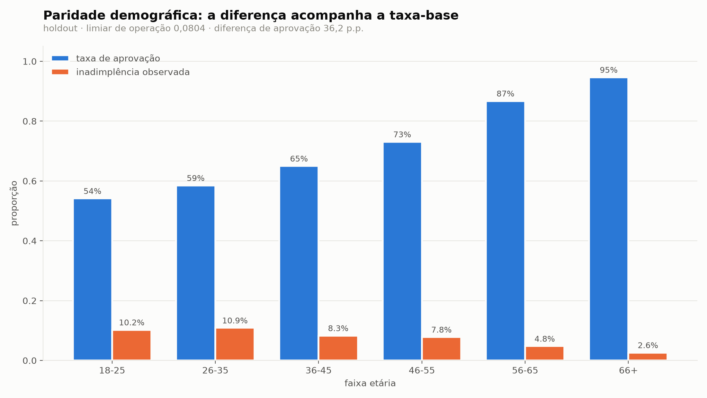
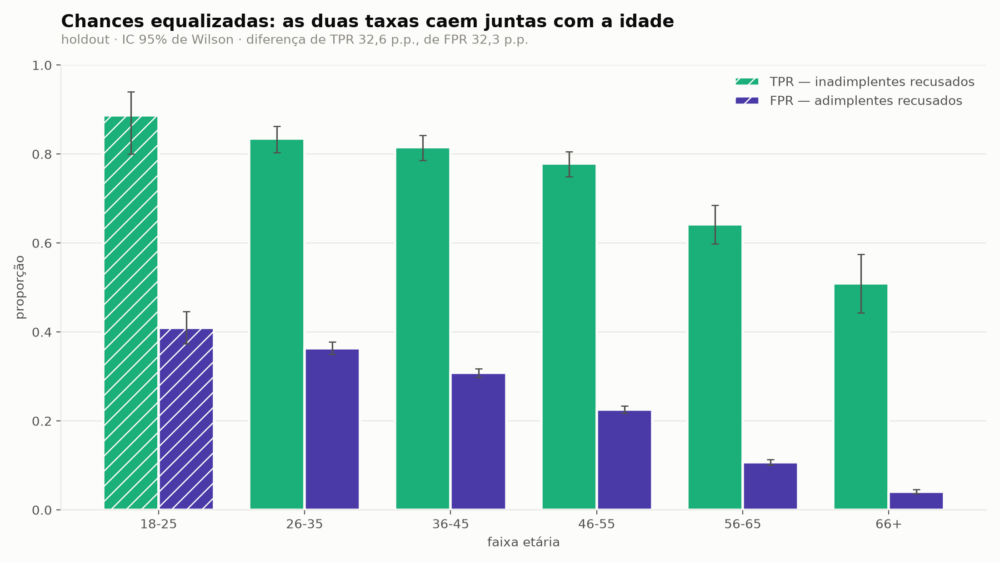
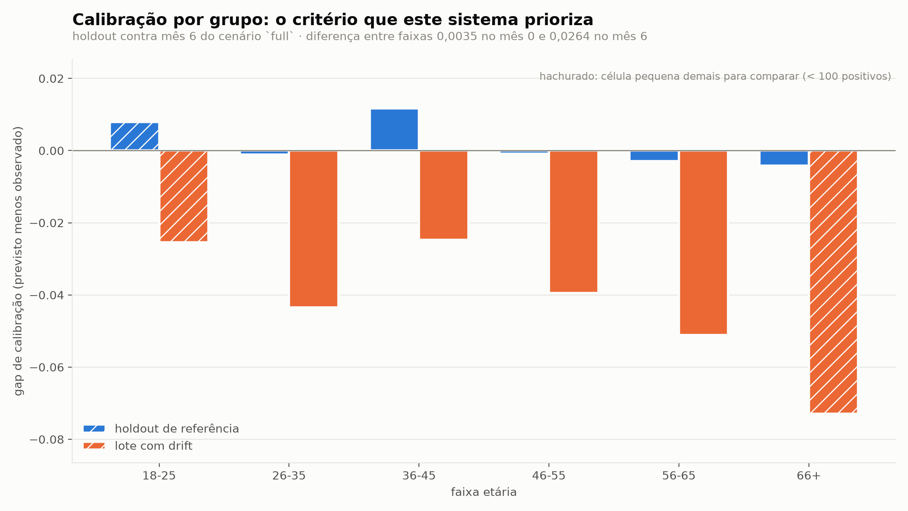

# Viés e não discriminação por faixa etária

**Etapa 4 · LGPD Art. 6, IX · medido em `scripts/bias_analysis.py`**

Todos os números deste documento saem de `reports/fairness/bands.json`, escrito
por `make bias`. Nenhum foi digitado à mão.

---

## 1. O que este dataset não tem, e o que não foi inventado

O *Give-Me-Some-Credit* **não tem raça, sexo, estado civil, cor, região nem
qualquer marcador de grupo protegido no sentido usual**. As 11 colunas são
idade, renda, dívida, utilização de crédito, dependentes, imóveis e três
contadores de atraso. É isso.

**Nenhum atributo foi simulado para preencher essa falta.** A tentação existe —
sortear um sexo sintético correlacionado com renda produz um documento de
justiça com aparência completa — e o que sairia dali seria a medição do gerador
sintético, não do modelo. Uma disparidade inventada é pior que uma disparidade
ausente, porque se parece com evidência.

> **Limitação, declarada e não contornada:** este documento **não** mede viés
> racial nem de gênero, e nada aqui autoriza concluir que o modelo não os tem.
> Um sistema real com dados cadastrais precisaria repetir esta análise nos eixos
> que a lei nomeia, e o Art. 6, IX cobre todos eles.

## 2. Por que idade é um eixo legítimo, e não um substituto

Idade não entra aqui como *proxy* de outra coisa. **Discriminação etária em
crédito é discriminação por direito próprio**: é um critério que separa pessoas
por uma característica que elas não escolhem, e um modelo de crédito que recuse
sistematicamente os mais jovens está fazendo exatamente o que o Art. 6, IX
proíbe se o fizer sem justificação.

Ela também é a feature com mais estrutura em relação ao alvo. Da matriz de
Pearson da inspeção (§10):

| par | Pearson |
|---|---|
| `age` × `SeriousDlqin2yrs` | **-0,12** |
| `age` × `NumberOfDependents` | **-0,21** |

Uma ressalva que este projeto é obrigado a fazer a si mesmo: o achado §8 do
`findings.md` estabeleceu que **neste dataset um Pearson perto de zero é
evidência de que a coluna tem cauda**, não de que não há relação. Aqui o
argumento não se aplica — `age` tem desvio 14,77 num intervalo de 0 a 109, sem
cauda pesada, e os dois coeficientes estão longe de zero. Pearson serve nesta
coluna, e serve porque se verificou que serve.

Faixas: **18-25, 26-35, 36-45, 46-55, 56-65, 66+**.

## 3. Tamanhos de faixa, antes de qualquer taxa

Uma taxa sem denominador é um número sem erro. O holdout tem 44.208 linhas e as
faixas são desiguais por mais de uma ordem de grandeza:

| faixa | n | % do holdout | positivos (inadimplentes) | comparável? |
|---|---|---|---|---|
| 18-25 | 781 | 1,8% | **80** | **não** |
| 26-35 | 5.454 | 12,3% | 594 | sim |
| 36-45 | 8.897 | 20,1% | 739 | sim |
| 46-55 | 10.860 | 24,6% | 849 | sim |
| 56-65 | 9.835 | 22,2% | 470 | sim |
| 66+ | 8.381 | 19,0% | 220 | sim |

A coluna que decide não é `n`, é **positivos**: TPR tem os inadimplentes no
denominador, e é essa célula que fica pequena primeiro. O piso adotado é **100
positivos** (`MIN_CELL_FOR_COMPARISON`), e a faixa 18-25 fica abaixo dele.

Ela **continua reportada**, com intervalo, nunca em silêncio. Todo intervalo
neste documento é de **Wilson a 95%**, e não a aproximação normal: com taxa de
positivos perto de 6% e faixas de algumas centenas de linhas, o intervalo normal
desce abaixo de zero e para de significar coisa alguma.

## 4. O limiar de operação: escolhido hoje, e onde

**Este projeto nunca havia escolhido um limiar.** Todas as métricas das etapas 1
a 3 são livres de corte — AUC e KS medem ordenação, o gap de calibração compara
médias. Nenhuma delas exige decidir quem é recusado, e justamente por isso
nenhuma delas exigia essa decisão.

Justiça de grupo exige. TPR, FPR, precisão e taxa de aprovação só existem depois
que alguém traça a linha.

**Limiar adotado: `p >= 0,080357` recusa.** É o **limiar de KS do campeão
calibrado**, o ponto de separação máxima entre as duas distribuições, e já
estava medido em `training_summary.json` desde a etapa 1.

Três razões para este e não outro:

1. **Foi ajustado na partição de validação, não no holdout.** Escolher o corte
   na mesma amostra em que a justiça é medida é escolher sabendo a resposta.
2. **Não foi ajustado olhando para faixa etária.** Um limiar escolhido para
   fechar uma disparidade é um limiar que reporta a própria escolha.
3. **É derivado de uma quantidade livre de corte.** O KS não conhece nenhum
   limiar; o ponto em que ele é atingido é uma consequência da curva ROC.

O que ele implica no holdout: **76,46% de aprovação global**, sobre uma taxa de
inadimplência de 6,68%.

> Um limiar real não sai de uma estatística. Sai de uma razão de custos — quanto
> custa aprovar um inadimplente contra quanto custa recusar um bom cliente — e
> essa razão é decisão de negócio, não de modelagem. O limiar de KS é o
> **substituto defensável na ausência dela**, e está registrado como tal.

## 5. As métricas por faixa — holdout de referência

Limiar 0,080357. "Aprovação" é o nome da previsão negativa do modelo: este
projeto não tem uma decisão de crédito acoplada a ele.

| faixa | n | inadimplência observada | previsto médio | **aprovação** | TPR | FPR | precisão | **gap de calibração** |
|---|---|---|---|---|---|---|---|---|
| 18-25 | 781 | 10,24% | 11,03% | **54,16%** | 0,8875 | 0,4094 | 0,1983 | **+0,0079** |
| 26-35 | 5.454 | 10,89% | 10,79% | **58,51%** | 0,8350 | 0,3636 | 0,2192 | **-0,0010** |
| 36-45 | 8.897 | 8,31% | 9,48% | **65,00%** | 0,8160 | 0,3078 | 0,1936 | **+0,0117** |
| 46-55 | 10.860 | 7,82% | 7,74% | **73,09%** | 0,7786 | 0,2259 | 0,2262 | **-0,0008** |
| 56-65 | 9.835 | 4,78% | 4,49% | **86,74%** | 0,6426 | 0,1070 | 0,2316 | **-0,0029** |
| 66+ | 8.381 | 2,62% | 2,20% | **94,67%** | 0,5091 | 0,0410 | 0,2506 | **-0,0042** |

Com intervalos, nas três quantidades que mais se movem:

| faixa | aprovação [IC 95%] | TPR [IC 95%] | gap [IC 95%] |
|---|---|---|---|
| **18-25** | 0,542 [0,507 – 0,576] | **0,887 [0,800 – 0,940]** | +0,0079 [-0,0154 – +0,0272] |
| 26-35 | 0,585 [0,572 – 0,598] | 0,835 [0,803 – 0,863] | -0,0010 [-0,0096 – +0,0069] |
| 36-45 | 0,650 [0,640 – 0,660] | 0,816 [0,786 – 0,842] | +0,0117 [+0,0058 – +0,0173] |
| 46-55 | 0,731 [0,723 – 0,739] | 0,779 [0,749 – 0,805] | -0,0008 [-0,0060 – +0,0041] |
| 56-65 | 0,867 [0,861 – 0,874] | 0,643 [0,598 – 0,685] | -0,0029 [-0,0073 – +0,0012] |
| 66+ | 0,947 [0,942 – 0,951] | 0,509 [0,443 – 0,574] | -0,0042 [-0,0079 – -0,0010] |

O intervalo da 18-25 tem **14 pontos de largura** no TPR contra 6 na 26-35.
É a diferença entre 80 e 594 inadimplentes, e é por isso que a faixa não entra
nas comparações do §6.



## 6. Os três critérios, pelo nome

### A convenção, declarada uma vez e usada em todo o documento

Todo critério deste documento é uma **diferença entre faixas**, e uma diferença
só significa alguma coisa sobre um conjunto de faixas declarado. A regra, sem
exceção:

1. **O critério é sempre calculado apenas sobre as faixas comparáveis** — as que
   têm 100 ou mais inadimplentes.
2. **As faixas excluídas são sempre nomeadas** ao lado do número.
3. **Comparações entre populações usam a interseção** dos conjuntos comparáveis
   das duas, porque o conjunto comparável muda com o tamanho da amostra.

A regra 3 não é zelo. O holdout tem cinco faixas comparáveis, o mês 0 tem três e
o mês 6 tem quatro; subtrair um critério calculado sobre conjuntos diferentes é
subtrair respostas a perguntas diferentes. O §7 mostra o quanto isso muda a
conclusão.

| critério | definição | **medido (holdout)** |
|---|---|---|
| **paridade demográfica** | maior menos menor taxa de aprovação | **0,3616** |
| **chances equalizadas** | o maior dos dois: diferença de TPR e de FPR | **0,3259** (TPR) · 0,3225 (FPR) |
| **calibração por grupo** | maior menos menor gap de calibração | **0,0159** |
| *(a causa)* | maior menos menor taxa-base observada | **0,0827** |

> **Faixas comparadas: 26-35, 36-45, 46-55, 56-65, 66+.**
> **Excluída: 18-25** (80 inadimplentes, abaixo do piso de 100).

O **0,0159** sai de +0,0117 na faixa 36-45 menos -0,0042 na 66+. Incluindo a
18-25, cujo gap é +0,0079, o número **não mudaria** — ela cai dentro do
intervalo das outras. É coincidência favorável, não motivo para relaxar a regra:
no mês 6 a faixa excluída é a que define o extremo.



### Os três não podem valer ao mesmo tempo, e a tabela mostra por quê

Não é opinião nem escolha de ênfase: é um resultado de impossibilidade.
**Quando as taxas-base diferem entre grupos, paridade demográfica, chances
equalizadas e calibração por grupo não podem ser satisfeitas simultaneamente**
(salvo classificação perfeita). E elas diferem, muito:

```
inadimplência observada:   26-35 → 10,89%          66+ → 2,62%
                           quatro vezes maior na faixa mais jovem
```

O mecanismo é direto. Um score calibrado responde a probabilidade verdadeira; se
o risco verdadeiro da 26-35 é quatro vezes o da 66+, o score **tem que** ser
mais alto na 26-35 e qualquer corte fixo recusa mais gente lá. Para igualar as
taxas de aprovação seria preciso usar **limiares diferentes por faixa** — e aí o
mesmo score passa a significar coisas diferentes conforme a idade de quem é
avaliado, que é o dano que a calibração por grupo existe para impedir.

Não há solução técnica que ganhe dos três lados. Há uma escolha, e ela tem de
ser declarada.

### O critério que este sistema prioriza: **calibração por grupo**

E a razão é jurídica antes de ser estatística.

O **Art. 20 §1** dá ao titular o direito a informações claras sobre **os
critérios** da decisão automatizada. O critério, aqui, é um número: "sua
probabilidade estimada de inadimplência é X". Para que essa frase seja
informação e não formalidade, **X precisa significar a mesma coisa
independentemente de quem a recebe**. Calibração por grupo é exatamente essa
propriedade: entre todas as pessoas a quem o sistema atribui 12%, aproximadamente
12% inadimplem — em qualquer faixa etária.

Um modelo que falhasse aqui entregaria, à mesma pergunta, um número que vale
12% para um jovem e 20% para um idoso. As duas pessoas receberiam a mesma
explicação e estariam sendo avaliadas por réguas diferentes. **Isso é o Art. 20
cumprido na letra e violado no propósito**, e é o mesmo argumento que sustenta a
calibração isotônica do achado §5.

**Medido: 0,0159.** Os gaps por faixa vão de -0,0042 a +0,0117, e apenas duas
faixas têm intervalo que exclui zero (36-45 e 66+, ambas por margem estreita).
Em termos práticos o modelo está calibrado dentro de cada faixa etária.

### O que a escolha custa, dito sem suavizar

Priorizar calibração **não faz a diferença de 36 pontos na aprovação
desaparecer**, e não a torna aceitável por decreto. Ela continua lá: a faixa
18-25 é aprovada em 54% e a 66+ em 95%.

A defesa é que a diferença **acompanha a taxa-base** em vez de excedê-la — o
modelo está reproduzindo uma diferença de risco que existe nos dados, não
criando uma. Essa defesa tem um limite, e o limite é que **os dados vêm de
decisões de crédito passadas**: se a concessão histórica já era enviesada contra
os mais jovens, a inadimplência observada nessa faixa carrega esse viés, e um
modelo calibrado sobre ela reproduz o viés com a aparência de correção. Nada
neste dataset permite separar as duas coisas. Fica registrado como o que é: um
limite do que se pode concluir, não uma nota de rodapé.

## 7. O drift piora a justiça? Mês 6 do cenário `full`

O mecanismo de composição desloca a carteira **para baixo na idade**, de
propósito. Se houvesse disparidade para aparecer, apareceria aqui.

### A carteira muda de forma

| faixa | mês 0 | mês 6 | variação |
|---|---|---|---|
| 18-25 | 1,8% | **4,0%** | **2,2× mais** |
| 26-35 | 12,4% | **23,4%** | **1,9× mais** |
| 36-45 | 19,7% | 27,3% | 1,4× mais |
| 46-55 | 24,3% | 24,9% | estável |
| 56-65 | 22,4% | 14,5% | 0,6× |
| 66+ | 19,4% | **6,0%** | **0,3×** |

A carteira rejuvenesce exatamente como desenhado: a 66+ perde dois terços da sua
presença e a 18-25 mais que dobra.

### E os critérios se movem — mas não todos na mesma direção

Aqui a convenção do §6 decide a resposta, e vale mostrar as duas versões.

**Cada mês sobre o seu próprio conjunto comparável** (a leitura ingênua):

| critério | mês 0 *(3 faixas)* | mês 6 *(4 faixas)* |
|---|---|---|
| paridade demográfica | 0,1554 | 0,2037 |
| chances equalizadas | 0,1474 | 0,2139 |
| calibração por grupo | 0,0035 | 0,0264 |

> mês 0 exclui 18-25, 56-65 e 66+ · mês 6 exclui 18-25 e 66+

Esses dois pares **não são comparáveis**. O mês 6 ganhou a faixa 56-65 no
conjunto, e ela está longe das outras; boa parte do aumento é a faixa nova
entrando na conta, não o modelo piorando.

**Sobre as faixas comparáveis nos dois meses — 26-35, 36-45, 46-55** (a leitura
correta):

| critério | mês 0 | mês 6 | |
|---|---|---|---|
| paridade demográfica | 0,1554 | **0,0753** | **melhora 2,1×** |
| chances equalizadas | 0,1474 | **0,0839** | **melhora 1,8×** |
| **calibração por grupo** | **0,0035** | **0,0187** | **piora 5,3×** |
| taxa-base entre faixas | 0,0331 | **0,0133** | **comprime 2,5×** |

**A resposta honesta é mais interessante que "sim, piora".** O drift **melhora**
dois dos três critérios e **piora** o terceiro — o que este sistema escolheu
proteger.

E o motivo está na última linha. O estresse empurra o risco de **todas** as
faixas para cima, e com isso **comprime as taxas-base** entre elas: de 0,0331
para 0,0133. Taxas-base mais parecidas produzem aprovações mais parecidas, e
paridade demográfica "melhora" — enquanto o modelo piora para todo mundo. É a
mesma armadilha do §8, e está registrada como achado §15.

A aprovação global cai de 76% para 33,5%, porque o limiar é fixo e o risco
subiu.

### Qual faixa é a mais prejudicada: a mais velha, não a mais jovem

| faixa | gap mês 0 | **gap mês 6** | IC 95% do mês 6 |
|---|---|---|---|
| 18-25 | -0,0042 | -0,0254 | [-0,0761 – +0,0181] |
| 26-35 | -0,0026 | -0,0435 | [-0,0647 – -0,0233] |
| 36-45 | +0,0009 | -0,0248 | [-0,0441 – -0,0064] |
| 46-55 | -0,0024 | -0,0395 | [-0,0600 – -0,0199] |
| 56-65 | -0,0011 | -0,0512 | [-0,0770 – -0,0273] |
| **66+** | -0,0086 | **-0,0730** | **[-0,1112 – -0,0403]** |

A faixa **66+** recebe o pior gap do painel: previsto 10,5% contra observado
17,8%, **7,3 pontos de subestimação**. É quase três vezes o da 18-25.

Isso contraria a expectativa óbvia — e a expectativa era minha, estava escrita, e
estava errada. O mecanismo empurra a carteira para os jovens; logo os jovens
seriam os prejudicados. Não são.

#### O mecanismo: a faixa encolhe **e** troca de conteúdo

O peso de amostragem da composição não olha só para a idade:

```
w ∝ exp( s · [ b_util·r(util) + b_age·(−r(age)) + b_d30·r(30-59) + … ] )
```

O termo `−r(age)` penaliza **toda** a faixa 66+ por igual — é o que a faz
encolher. Os demais termos continuam discriminando **dentro** dela, e favorecem
quem tem utilização alta e atraso registrado. Os poucos 66+ que sobrevivem à
seleção são, portanto, **os mais alavancados e mais inadimplentes da sua
faixa** — não uma amostra dela.

Medido dentro da faixa 66+, comparando o que o modelo aprendeu com o que ele
passou a receber:

| | holdout (treino) | `composition_only` mês 6 | |
|---|---|---|---|
| n | 8.381 | 426 | 0,05× |
| **utilização mediana** | **0,0469** | **0,3858** | **8,2×** |
| com utilização > 0,5 | 12,25% | 46,24% | 3,8× |
| com algum atraso registrado | 10,55% | 44,84% | 4,3× |
| média do contador 90d+ | 0,0286 | 0,2793 | 9,8× |
| **inadimplência observada** | **2,62%** | **15,02%** | **5,7×** |

**O modelo aprendeu "66+" como um grupo de 2,62% de risco e passou a receber um
subgrupo que inadimple a 15,02%** — 17,75% no cenário `full`, com os dois
mecanismos. O rótulo da faixa é o mesmo; as pessoas não são.

#### A consequência para relatórios de viés

**Drift de composição não muda apenas quem entra na carteira: muda quem cada
faixa passa a representar.** A categoria permanece e o que ela nomeia muda por
baixo.

Um relatório de viés que acompanhasse só o **tamanho** das faixas veria a 18-25
dobrar e a 66+ encolher, e concluiria que o grupo afetado é o que cresce. **Teria
errado o grupo** — que é exatamente o erro que este documento cometeu antes de
medir.

O acompanhamento correto exige as features **dentro** de cada faixa, o que é a
mesma coisa que dizer que o PSI precisa ser calculado **por grupo** e não só no
agregado. Este projeto não faz isso: o PSI é medido na carteira inteira. Fica
como limitação (§9) e como o próximo passo óbvio da instrumentação. Registrado
como achado §14.

E aqui está o cuidado que o §3 preparou: a faixa 66+ tem **79 inadimplentes** no
mês 6, abaixo do piso de 100, então ela **não entra** no cálculo do critério
agregado. O número de 0,0264 é calculado **sem** a faixa mais prejudicada.
Mas o intervalo dela **exclui zero com folga** — [-0,1112, -0,0403] —, então o
dano é real mesmo não sendo comparável no sentido estrito. A célula é pequena
demais para uma comparação entre faixas e grande o bastante para afirmar que o
gap não é zero. As duas coisas são verdadeiras e as duas estão ditas.



## 8. Qual mecanismo causa o dano — a ablação responde

A mesma medição nos braços da ablação, no mês 6, com a mesma semente. Ligar e
desligar um mecanismo é intervir (ver `docs/causalidade.md`).

### A composição move quem está na carteira

| braço | 18-25 | 26-35 | 36-45 | 46-55 | 56-65 | 66+ |
|---|---|---|---|---|---|---|
| `full` mês 0 | 1,8% | 12,4% | 19,7% | 24,3% | 22,4% | 19,4% |
| `composition_only` mês 6 | **4,3%** | **22,9%** | 27,0% | 25,3% | 14,8% | **5,8%** |
| `stress_only` mês 6 | 1,5% | 12,7% | 20,1% | 24,1% | 22,5% | 19,1% |

`composition_only` reproduz o deslocamento etário inteiro. `stress_only` deixa a
carteira **idêntica** ao mês 0 — a composição é dele e só dele.

### O estresse é que quebra a calibração, em todas as faixas

| braço | 18-25 | 26-35 | 36-45 | 46-55 | 56-65 | 66+ | gap agregado |
|---|---|---|---|---|---|---|---|
| `composition_only` | -0,0005 | -0,0046 | +0,0164 | -0,0093 | -0,0083 | **-0,0440** | **-0,0028** |
| `stress_only` | **-0,0603** | **-0,0399** | **-0,0207** | **-0,0405** | **-0,0379** | **-0,0276** | **-0,0337** |

Em negrito, os gaps cujo IC 95% exclui zero.

- **`composition_only`: uma faixa afetada, a que ele esvaziou.** Cinco das seis
  faixas têm intervalo que contém zero. A única exceção é a 66+ (-0,0440), e é
  precisamente a faixa que perdeu dois terços da sua massa. O drift de features
  deslocou quem está na carteira sem estragar o significado do score para eles.
- **`stress_only`: todas as seis faixas, todas negativas, todas com intervalo
  fora do zero.** A mudança de conceito não escolhe faixa: subestima o risco de
  todo mundo.

**O mecanismo que move a demografia não é o mecanismo que causa a injustiça.**
Esse é o resultado do dia, e ele tem uma consequência operacional desagradável:
o painel de drift enxerga `composition_only` com PSI de 0,93 e cinco features na
faixa vermelha, e é **cego** a `stress_only`, com PSI máximo de 0,0082. Quem
olhar o painel verá, em cores, o mecanismo que **não** está causando o dano de
calibração por faixa — e nada do que está.

### E um alerta sobre a própria métrica de justiça

Compare as duas últimas colunas da tabela acima:

| braço | **spread** da calibração entre faixas | **gap agregado** |
|---|---|---|
| `composition_only` | **0,0258** | -0,0028 |
| `stress_only` | **0,0198** | **-0,0337** |

O braço com **doze vezes** mais dano agregado de calibração tem o **menor**
spread entre faixas. Uma métrica de justiça definida como *diferença entre
grupos* não pode enxergar um dano que cai sobre todos os grupos de forma
parecida: a diferença fica pequena justamente porque ninguém escapou.

Um relatório que trouxesse só os três critérios do §6 concluiria que
`stress_only` é **mais justo** que `composition_only`. É falso, e é falso de um
jeito que nenhum número da tabela denuncia sozinho.

> **Regra que sai daqui:** justiça de grupo se reporta com o **nível** por
> faixa, não só com a **diferença** entre faixas. Diferença é cega para falha de
> modo comum. É por isso que a tabela do §7 lista os seis gaps antes de listar o
> spread.

## 9. Limitações

1. **Sem raça, sexo ou estado civil.** O eixo medido é um só, e nada foi
   simulado para preencher os outros. Um sistema real repete isto em todos os
   eixos que o Art. 6, IX nomeia.
2. **A faixa 18-25 nunca atinge o piso de comparação.** 80 positivos no holdout,
   65 no mês 6. Reportada sempre com intervalo, nunca no cálculo dos critérios.
3. **A faixa 66+ sai do piso justamente quando é mais prejudicada.** 79
   positivos no mês 6, quando o gap chega a -0,0730. O critério agregado do §7 é
   calculado sem ela.
4. **Taxa-base não é risco verdadeiro.** É o desfecho de decisões de crédito
   passadas. Se a concessão histórica foi enviesada, a calibração reproduz o
   viés com cara de acerto, e este dataset não permite separar as duas coisas.
5. **O limiar é um substituto.** Sai do KS, não de uma razão de custos. Todos os
   números dos §5 a §8 se movem se o limiar se mover; a ordem entre as faixas,
   não.
6. **Nenhuma mitigação foi aplicada.** Não há reponderação por grupo, limiar por
   faixa nem restrição de justiça no treino. Este documento mede; não corrige.
7. **O PSI é medido na carteira inteira, não por faixa.** É por isso que a
   mudança de composição *dentro* da faixa 66+ (§7) não apareceria em nenhum
   painel deste projeto. Próximo passo óbvio da instrumentação.
8. **Os braços da ablação são nossos.** O que o §8 identifica vale dentro do
   mundo simulado. Ver o limite do que se pode afirmar em `docs/causalidade.md`.

## 10. Reproduzir

```bash
make bias     # escreve reports/fairness/{bands.json,*.png} e imprime as tabelas
```
