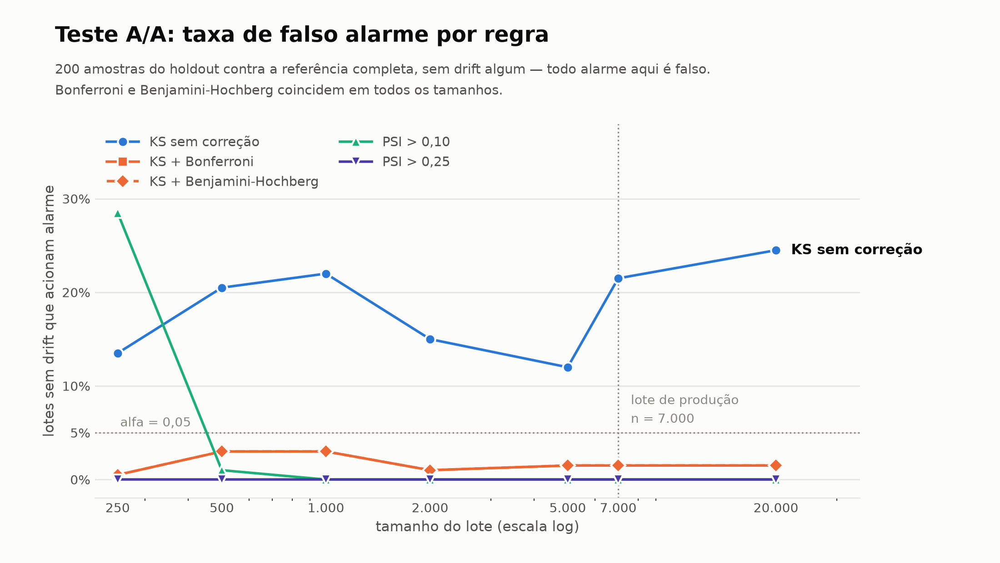

# Testes estatísticos de drift — etapa 2

Gerado por `make aa-test` e `make mmd`. Determinístico a partir da semente
20260922. Referência: 103,152 linhas; holdout: 44,208.

---

## 1. Teste A/A: quantos alarmes numa população sem drift

200 amostras do holdout por tamanho, comparadas contra a referência
completa. O holdout foi lacrado na etapa 1 exatamente para isto, e os dois
conjuntos são disjuntos por construção. **Todo alarme aqui é falso.**

### Taxa por lote (qualquer feature dispara)

| n | KS sem correção | KS + Bonferroni | KS + BH | PSI > 0,10 | PSI > 0,25 |
|---|---|---|---|---|---|
| 250 | 13.5% | 0.5% | 0.5% | 28.5% | 0.0% |
| 500 | 20.5% | 3.0% | 3.0% | 1.0% | 0.0% |
| 1,000 | 22.0% | 3.0% | 3.0% | 0.0% | 0.0% |
| 2,000 | 15.0% | 1.0% | 1.0% | 0.0% | 0.0% |
| 5,000 | 12.0% | 1.5% | 1.5% | 0.0% | 0.0% |
| 7,000 | 21.5% | 1.5% | 1.5% | 0.0% | 0.0% |
| 20,000 | 24.5% | 1.5% | 1.5% | 0.0% | 0.0% |

### A afirmação original estava errada

O plano vinha dizendo que "KS gera falso alarme com amostra grande". Sob o nulo
verdadeiro os p-valores do KS são uniformes, então a taxa **por feature** fica
em alfa para qualquer n. É o que se mede:

| tipo | n = 250 | n = 500 | n = 1.000 | n = 2.000 | n = 5.000 | n = 7.000 | n = 20.000 |
|---|---|---|---|---|---|---|---|
| contagem | 0.4% | 0.8% | 0.6% | 0.6% | 0.4% | 0.3% | 0.6% |
| contínua | 2.9% | 4.4% | 5.1% | 3.1% | 3.0% | 5.9% | 6.2% |

Nas contínuas a taxa orbita alfa = 0,05 em todos os tamanhos. Nas contagens ela
fica **cinco a dez vezes abaixo**, porque os empates tornam o KS conservador —
nos três contadores de atraso ela é exatamente **0,000 em todos os n**.

O problema do KS não é a taxa por feature. São **múltiplas comparações**: onze
features a 5% dão de 12% a 25% de lotes limpos acionando o painel, e isso quase
não depende de n. Bonferroni e Benjamini-Hochberg derrubam para 0,5%-3,0%, e
**coincidem em todos os tamanhos** — com no máximo um p-valor pequeno sob o
nulo, o corte do BH no primeiro posto é o próprio Bonferroni.

### O PSI falha no regime oposto, e de forma previsível

| n | PSI médio medido | previsto (bins-1)(1/n+1/m) | razão |
|---|---|---|---|
| 250 | 0.0412 | 0.0437 | 0.94 |
| 500 | 0.0212 | 0.0219 | 0.97 |
| 1,000 | 0.0115 | 0.0110 | 1.04 |
| 2,000 | 0.0057 | 0.0056 | 1.03 |
| 5,000 | 0.0025 | 0.0023 | 1.09 |
| 7,000 | 0.0019 | 0.0017 | 1.13 |
| 20,000 | 0.0008 | 0.0007 | 1.21 |

A razão entre medido e previsto fica entre 0,94 e 1,21: o viés de pequena
amostra do PSI **não é mistério**, é `(bins-1)(1/n + 1/m)`. Quem paga são as
colunas com mais bins:

| feature | disparos PSI > 0,10 | bins | viés previsto |
|---|---|---|---|
| NumberOfTimes90DaysLate | 12.0% | 17 | 0.0642 |
| NumberRealEstateLoansOrLines | 10.5% | 26 | 0.1002 |
| NumberOfTime30-59DaysPastDueNotWorse | 7.5% | 13 | 0.0481 |
| NumberOfTime60-89DaysPastDueNotWorse | 2.0% | 10 | 0.0361 |
| NumberOfDependents | 0.5% | 13 | 0.0481 |

Isso é o custo da correção do dia 6. A regra de um bin por valor consertou a
cegueira do PSI nas colunas 94% zeradas, e em troca deu a elas 17 e 26 bins —
mais bins, mais viés a n pequeno. `NumberRealEstateLoansOrLines` tem viés
previsto de 0,1002 a n = 250, que é o limiar de alerta.

### Recomendação operacional para n ≈ 7.000

| regra | falso alarme medido | veredito |
|---|---|---|
| KS sem correção | **21,5%** | inutilizável como portão de lote |
| KS + Bonferroni | 1,5% | usável, mas responde à pergunta errada (ver §2) |
| PSI > 0,10 | **0,0%** | usável como alerta |
| PSI > 0,25 | **0,0%** | usável como bloqueio |

**Adotar PSI com 0,10/0,25 como regra de veredito, e manter o KS como
diagnóstico com Bonferroni.** No nosso tamanho de lote o PSI não deu **nenhum**
falso alarme em 200 sorteios (o que limita a taxa real a menos de 1,5% com 95%
de confiança), e ele mede magnitude, que é o que falta ao KS. O KS sem correção
pintaria o painel de vermelho em mais de um de cada cinco lotes perfeitamente
normais.

A recomendação **depende do tamanho do lote**: abaixo de n ≈ 500 o PSI > 0,10
inverte e passa a ser o pior dos dois (28,5% a n = 250). Um limiar calibrado num
tamanho de lote está errado em outro.

### Regra operacional: tamanho mínimo de lote

> **Abaixo de n = 1.000 os limiares de PSI não valem. O veredito tem de ser
> `INSUFFICIENT_SAMPLE` — nunca verde, nunca vermelho.**

O viés de pequena amostra do PSI atinge o **limiar de alerta** a n = 250 na
coluna de 26 bins: viés previsto de 0,1002 contra um limiar de 0,10. Nesse
tamanho, 28,5% dos lotes sem drift algum disparavam.

Um lote pequeno não torna o drift menos provável — torna a medição incapaz de
separar drift do próprio viés. Pintar verde afirmaria estabilidade que não foi
medida; pintar vermelho afirmaria drift que pode ser só o estimador. A única
resposta honesta é recusar o veredito.

O piso é 1.000 e não 500: a 500 o falso alarme já caiu para 1,0%, mas a margem
é estreita e o viés médio ainda é 0,0212. **1.000 é o primeiro tamanho com 0,0%
medido.** Registrado em `configs/monitoring.yaml` como `min_batch_size`;
`credit_monitor.reporting.drift.verdict` já o aplica quando recebe o tamanho do
lote, e a etapa 3 o transforma em portão.

---

## 2. Significância não é magnitude

Varredura do mecanismo de inflação sozinho — o que a ablação mostrou ser quase
inerte.

### DebtRatio

| π | n | p-valor KS | PSI | Δ previsão média | Δ AUC |
|---|---|---|---|---|---|
| 0.01 | 1,000 | 7.38e-02 | 0.0118 | -0.00036 | +0.00104 |
| 0.02 | 1,000 | 4.31e-02 | 0.0092 | -0.00071 | +0.00448 |
| 0.05 | 1,000 | 6.88e-03 | 0.0163 | -0.00126 | -0.00056 |
| 0.10 | 1,000 | 1.07e-04 | 0.0300 | -0.00143 | -0.00143 |
| 0.01 | 7,000 | 4.56e-02 | 0.0037 | -0.00030 | -0.00043 |
| 0.02 | 7,000 | 1.43e-02 | 0.0050 | -0.00048 | -0.00014 |
| 0.05 | 7,000 | 2.79e-05 | 0.0073 | -0.00081 | -0.00064 |
| 0.10 | 7,000 | 4.44e-14 | 0.0142 | -0.00137 | +0.00020 |
| 0.01 | 44,000 | 2.08e-04 | 0.0008 | -0.00035 | -0.00032 |
| 0.02 | 44,000 | 1.38e-04 | 0.0011 | -0.00040 | -0.00037 |
| 0.05 | 44,000 | 1.12e-13 | 0.0035 | -0.00074 | +0.00009 |
| 0.10 | 44,000 | 2.31e-48 | 0.0114 | -0.00151 | +0.00073 |

### MonthlyIncome

| π | n | p-valor KS | PSI | Δ previsão média | Δ AUC |
|---|---|---|---|---|---|
| 0.01 | 1,000 | 2.00e-01 | 0.0057 | -0.00036 | +0.00104 |
| 0.02 | 1,000 | 1.03e-01 | 0.0063 | -0.00071 | +0.00448 |
| 0.05 | 1,000 | 1.43e-02 | 0.0212 | -0.00126 | -0.00056 |
| 0.10 | 1,000 | 9.25e-06 | 0.0354 | -0.00143 | -0.00143 |
| 0.01 | 7,000 | 1.04e-03 | 0.0034 | -0.00030 | -0.00043 |
| 0.02 | 7,000 | 1.61e-04 | 0.0028 | -0.00048 | -0.00014 |
| 0.05 | 7,000 | 3.56e-09 | 0.0106 | -0.00081 | -0.00064 |
| 0.10 | 7,000 | 6.25e-20 | 0.0244 | -0.00137 | +0.00020 |
| 0.01 | 44,000 | 5.98e-11 | 0.0015 | -0.00035 | -0.00032 |
| 0.02 | 44,000 | 3.76e-14 | 0.0008 | -0.00040 | -0.00037 |
| 0.05 | 44,000 | 2.58e-33 | 0.0074 | -0.00074 | +0.00009 |
| 0.10 | 44,000 | 1.18e-80 | 0.0209 | -0.00151 | +0.00073 |

A n = 44.000 com π = 0,01 — **um por cento** de inflação — o KS na renda dá
p = 6e-11 enquanto o PSI marca 0,0015, a previsão média se move 3,5 pontos-base
e o AUC muda na quarta casa. O mesmo deslocamento, na mesma direção, é
**invisível** ao KS a n = 1.000 (p = 0,20).

O veredito do KS é decidido pelo tamanho do lote, não pelo tamanho do efeito. É
um alarme verdadeiro — a distribuição mudou mesmo — e operacionalmente inútil.

---

## 3. MMD: o drift que nenhuma marginal revela

Features transformadas em **escores normais de posto** ajustados na referência,
kernel RBF com largura pela heurística da mediana, teste de permutação com
1000 permutações e n = 2.000 por lado. Custo: ~1,1 s para os quatro testes,
porque as permutações saem de um produto de matrizes sobre o kernel
pré-computado em vez de recomputá-lo mil vezes.

Escores de posto e não valores brutos porque o kernel é função de distância:
uma coluna com desvio 249,76 dominaria toda distância par a par e o teste
mediria só ela. É a lição dos achados §4, §6 e §8 aplicada a kernels.

| lote | MMD² | p | detecta |
|---|---|---|---|
| month_00 (controle) | -0.000076 | 0.6513 | não |
| multivariado primário (open_lines / real_estate) | 0.003463 | ≤ 0.001 (piso de 1000 permutações) | **SIM** |
| multivariado aperto de crédito (utilização / idade) | 0.000922 | ≤ 0.001 (piso de 1000 permutações) | **SIM** |
| month_06 (sanidade) | 0.064634 | ≤ 0.001 (piso de 1000 permutações) | **SIM** |

O lote de controle **não é detectado** (p = 0,65), que é a condição mínima para
o teste valer alguma coisa. Os dois lotes só-multivariados **são** detectados no
piso do p-valor permutacional, e o PSI univariado deles é 0,0041 em toda
feature — verde com duas ordens de grandeza de folga.

### O A/A do próprio MMD

Taxa de falso alarme: **4.0%** em 100 repetições, com p-valores uniformes (quartis [0.241, 0.5, 0.674]).

### Localização: MMD diz *que* mudou, não *onde*

**primário** — o par invertido sai em **#1**

| par | MMD² | p |
|---|---|---|
| `NumberOfOpenCreditLinesAndLoans` / `NumberRealEstateLoansOrLines` **← par invertido** | 0.026168 | ≤ 0.005 (piso de 200 permutações) |
| `DebtRatio` / `NumberRealEstateLoansOrLines` | 0.014563 | ≤ 0.005 (piso de 200 permutações) |
| `MonthlyIncome` / `NumberRealEstateLoansOrLines` | 0.008163 | ≤ 0.005 (piso de 200 permutações) |
| `age` / `NumberRealEstateLoansOrLines` | 0.003410 | 0.0100 |

**aperto de crédito** — o par invertido sai em **#1**

| par | MMD² | p |
|---|---|---|
| `RevolvingUtilizationOfUnsecuredLines` / `age` **← par invertido** | 0.010150 | ≤ 0.005 (piso de 200 permutações) |
| `age` / `MonthlyIncome` | 0.004331 | ≤ 0.005 (piso de 200 permutações) |
| `age` / `NumberOfDependents` | 0.004155 | ≤ 0.005 (piso de 200 permutações) |
| `age` / `NumberRealEstateLoansOrLines` | 0.003393 | ≤ 0.005 (piso de 200 permutações) |

Nos dois lotes o par invertido sai em primeiro. No primário, os pares seguintes
também envolvem `NumberRealEstateLoansOrLines`: permutar uma coluna muda a
dependência dela com **todas** as outras, não só com a parceira, então a
localização aponta para a coluna tanto quanto para o par.

---

## 4. O que fica para a etapa 3

- Veredito por **PSI** (0,10 alerta / 0,25 bloqueio) no tamanho de lote atual.
- **KS só com correção** e só como diagnóstico, nunca como portão.
- **MMD como segunda linha**, porque é o único que vê dependência — e com
  localização por par, senão ele diz que algo mudou sem dizer o quê.
- Nenhum limiar univariado é transportável entre tamanhos de lote.
